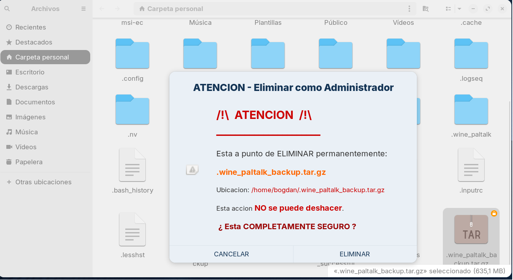

# 🛡️ Nautilus Clic Derecho Administrador (3 estados)

&gt; Elimina archivos como administrador directamente desde el menú contextual con un diálogo de advertencia de seguridad.



---

## 📦 Instalación Rápida

```bash
git clone https://github.com/bogdansaniuta/Nautilus-clickderecho-Administrador-3estados.git
cd Nautilus-clickderecho-Administrador-3estados
sudo ./install.sh

Requiere: Cerrar sesión y volver a iniciar (o reiniciar) después de instalar.
📖 Cómo Usar
Abre el Administrador de Archivos (Nautilus)
Navega a cualquier carpeta con archivos protegidos
Clic derecho en el archivo que quieres eliminar
Selecciona: "Eliminar como Administrador"
Lee la advertencia y pulsa ELIMINAR o CANCELAR
Introduce tu contraseña si te la solicitan
¡El archivo se elimina directamente — no se abre ninguna ventana nueva!

## 🖥️ Compatibilidad
Table
Distribución	Estado
Zorin OS	✅ Probado
Ubuntu	✅ Compatible
Linux Mint	✅ Compatible
Debian	✅ Compatible
Pop!_OS	✅ Compatible

## Requisitos:
Nautilus (Archivos de GNOME)
zenity
python3-nautilus

## 🗑️ Desinstalación
bash
sudo ./uninstall.sh
Luego cierra sesión y vuelve a iniciar.

## 🎨 Personalización
Puedes modificar colores, texto y tamaño editando:
bash
sudo nano /usr/local/bin/nautilus-admin-delete.sh
Colores Disponibles
Table
Código	Color
#CC0000	Rojo intenso
#FF6600	Naranja
#990000	Rojo oscuro
#333333	Gris oscuro

## 🤝 Contribuir
Haz fork del repositorio
Crea una rama (git checkout -b feature/nueva-funcion)
Confirma tus cambios (git commit -am 'Añadir nueva funcion')
Sube la rama (git push origin feature/nueva-funcion)
Abre una Pull Request
##  📄 Licencia
Licencia MIT — Libre para usar, modificar y distribuir.
🙏 Créditos
Autor: BogdanSaniuta
Sistema: Zorin OS
Inspiración: Función "Ejecutar como administrador" de Windows
##  ⚠️ ADVERTENCIA: Usa esta herramienta con precaución. Los archivos eliminados no se pueden recuperar.
